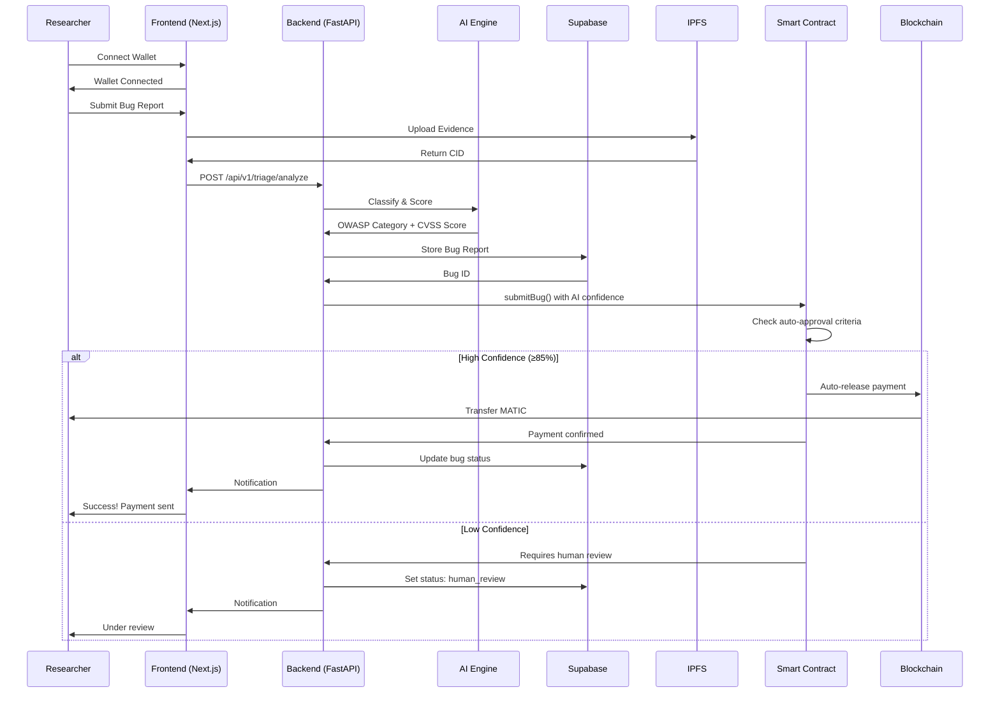

# 🏗️ Anti-Gravity Bug Bounty Platform - Project Structure

## Complete Directory Tree

```
bug-bounty-project/
│
├── 📄 README.md                          # Project overview & quick start
├── 📄 .gitignore                         # Git ignore rules
│
├── 📁 backend/                           # Python FastAPI Backend
│   ├── 📄 main.py                        # FastAPI entry point
│   ├── 📄 requirements.txt               # Python dependencies
│   ├── 📄 .env.example                   # Environment template
│   ├── 📄 .env                           # Environment variables (create this)
│   │
│   ├── 📁 app/
│   │   ├── 📁 core/                      # Core configuration
│   │   │   ├── config.py                 # Settings & environment
│   │   │   ├── security.py               # Wallet signature verification
│   │   │   └── dependencies.py           # Shared dependencies
│   │   │
│   │   ├── 📁 api/                       # API routes
│   │   │   ├── 📁 routes/
│   │   │   │   ├── bugs.py               # Bug submission endpoints
│   │   │   │   ├── projects.py           # Project management
│   │   │   │   ├── reputation.py         # Reputation queries
│   │   │   │   └── triage.py             # AI triage endpoint
│   │   │   └── deps.py                   # Route dependencies
│   │   │
│   │   ├── 📁 ml/                        # AI/ML Engine
│   │   │   ├── 📁 models/
│   │   │   │   ├── owasp_classifier.py   # OWASP Top 10 classifier
│   │   │   │   ├── cvss_scorer.py        # CVSS score calculator
│   │   │   │   └── spam_detector.py      # Spam filter
│   │   │   ├── preprocessing.py          # Text preprocessing
│   │   │   └── model_loader.py           # Model initialization
│   │   │
│   │   ├── 📁 services/                  # Business logic
│   │   │   ├── reputation_engine.py      # Trust score calculation
│   │   │   ├── ipfs_service.py           # Evidence upload to IPFS
│   │   │   ├── blockchain_service.py     # Smart contract interaction
│   │   │   └── notification_service.py   # User notifications
│   │   │
│   │   ├── 📁 models/                    # Pydantic models
│   │   │   ├── bug_report.py             # Bug report schemas
│   │   │   ├── user.py                   # User schemas
│   │   │   └── project.py                # Project schemas
│   │   │
│   │   └── 📁 db/                        # Database layer
│   │       ├── supabase_client.py        # Database connection
│   │       └── 📁 repositories/          # Data access layer
│   │           ├── bug_repository.py
│   │           ├── user_repository.py
│   │           └── project_repository.py
│   │
│   ├── 📁 models/                        # Trained ML models (gitignored)
│   │   ├── owasp_classifier/
│   │   ├── cvss_scorer/
│   │   └── spam_detector/
│   │
│   ├── 📁 tests/                         # Backend tests
│   │   ├── test_triage.py
│   │   ├── test_reputation.py
│   │   └── test_api.py
│   │
│   └── 📁 logs/                          # Application logs (gitignored)
│
├── 📁 frontend/                          # Next.js Frontend
│   ├── 📄 package.json                   # Node dependencies
│   ├── 📄 .env.example                   # Environment template
│   ├── 📄 .env.local                     # Environment variables (create this)
│   ├── 📄 next.config.js                 # Next.js configuration
│   ├── 📄 tailwind.config.ts             # TailwindCSS configuration
│   ├── 📄 tsconfig.json                  # TypeScript configuration
│   │
│   ├── 📁 app/                           # Next.js App Router
│   │   ├── layout.tsx                    # Root layout with providers
│   │   ├── page.tsx                      # Landing page
│   │   ├── globals.css                   # Global styles
│   │   │
│   │   ├── 📁 dashboard/                 # Researcher dashboard
│   │   │   ├── page.tsx
│   │   │   └── layout.tsx
│   │   │
│   │   ├── 📁 projects/                  # Project management
│   │   │   ├── page.tsx                  # Projects list
│   │   │   └── 📁 [id]/
│   │   │       ├── page.tsx              # Project details
│   │   │       └── bugs/
│   │   │           └── page.tsx          # Project bugs
│   │   │
│   │   ├── 📁 submit/                    # Bug submission
│   │   │   └── page.tsx
│   │   │
│   │   ├── 📁 leaderboard/               # Reputation leaderboard
│   │   │   └── page.tsx
│   │   │
│   │   └── 📁 api/                       # API routes (if needed)
│   │       └── auth/
│   │
│   ├── 📁 components/                    # React components
│   │   ├── 📁 ui/                        # Shadcn UI components
│   │   │   ├── button.tsx
│   │   │   ├── card.tsx
│   │   │   ├── dialog.tsx
│   │   │   ├── input.tsx
│   │   │   ├── select.tsx
│   │   │   ├── toast.tsx
│   │   │   └── ...
│   │   │
│   │   ├── 📁 wallet/
│   │   │   ├── ConnectButton.tsx         # Wallet connection
│   │   │   └── WalletInfo.tsx            # Wallet display
│   │   │
│   │   ├── 📁 bugs/
│   │   │   ├── BugSubmissionForm.tsx     # Bug submission form
│   │   │   ├── BugCard.tsx               # Bug display card
│   │   │   ├── BugList.tsx               # Bug list
│   │   │   └── BugStatusBadge.tsx        # Status indicator
│   │   │
│   │   ├── 📁 reputation/
│   │   │   ├── TrustScoreBadge.tsx       # Trust score display
│   │   │   └── ReputationChart.tsx       # Reputation visualization
│   │   │
│   │   ├── 📁 projects/
│   │   │   ├── ProjectCard.tsx           # Project card
│   │   │   ├── ProjectList.tsx           # Projects grid
│   │   │   └── CreateProjectForm.tsx     # Project creation
│   │   │
│   │   └── 📁 layout/
│   │       ├── Header.tsx                # Site header
│   │       ├── Footer.tsx                # Site footer
│   │       └── Sidebar.tsx               # Navigation sidebar
│   │
│   ├── 📁 lib/                           # Utilities & configurations
│   │   ├── wagmi.ts                      # Wagmi configuration
│   │   ├── api.ts                        # API client
│   │   ├── utils.ts                      # Utility functions
│   │   └── contracts.ts                  # Contract hooks
│   │
│   ├── 📁 contracts/                     # Contract ABIs
│   │   └── BountyVault.json              # BountyVault ABI
│   │
│   ├── 📁 hooks/                         # Custom React hooks
│   │   ├── useContract.ts                # Contract interaction
│   │   ├── useReputation.ts              # Reputation queries
│   │   └── useBugs.ts                    # Bug queries
│   │
│   ├── 📁 types/                         # TypeScript types
│   │   ├── bug.ts
│   │   ├── user.ts
│   │   └── project.ts
│   │
│   └── 📁 public/                        # Static assets
│       ├── logo.svg
│       └── images/
│
├── 📁 contracts/                         # Smart Contracts
│   ├── 📄 package.json                   # Node dependencies
│   ├── 📄 hardhat.config.js              # Hardhat configuration
│   ├── 📄 .env.example                   # Environment template
│   ├── 📄 .env                           # Environment variables (create this)
│   │
│   ├── 📁 contracts/                     # Solidity contracts
│   │   └── BountyVault.sol               # Main bounty vault contract
│   │
│   ├── 📁 scripts/                       # Deployment scripts
│   │   ├── deploy.js                     # Main deployment script
│   │   └── verify.js                     # Contract verification
│   │
│   ├── 📁 test/                          # Contract tests
│   │   └── BountyVault.test.js           # Vault tests
│   │
│   ├── 📁 deployments/                   # Deployment records (gitignored)
│   │   ├── mumbai-deployment.json
│   │   └── polygon-deployment.json
│   │
│   └── 📁 artifacts/                     # Compiled contracts (gitignored)
│
├── 📁 database/                          # Database schemas
│   ├── schema.sql                        # PostgreSQL schema
│   └── migrations/                       # Database migrations
│       └── 001_initial_schema.sql
│
└── 📁 docs/                              # Documentation
    ├── API.md                            # API documentation
    ├── SMART_CONTRACTS.md                # Contract documentation
    ├── DEPLOYMENT.md                     # Deployment guide
    ├── ARCHITECTURE.md                   # System architecture
    └── CONTRIBUTING.md                   # Contribution guidelines
```

## 📊 Component Interaction Flow



## 🔑 Key Files to Create Next

### Backend Priority
1. `app/core/config.py` - Environment configuration
2. `app/ml/model_loader.py` - Load AI models on startup
3. `app/api/routes/triage.py` - AI triage endpoint
4. `app/services/reputation_engine.py` - Trust score logic
5. `app/db/supabase_client.py` - Database connection

### Frontend Priority
1. `app/layout.tsx` - Root layout with Web3 providers
2. `lib/wagmi.ts` - Wagmi configuration
3. `components/wallet/ConnectButton.tsx` - Wallet connection
4. `app/submit/page.tsx` - Bug submission page
5. `components/bugs/BugSubmissionForm.tsx` - Submission form

### Smart Contracts Priority
1. `test/BountyVault.test.js` - Contract tests
2. `scripts/verify.js` - Contract verification script

## 📦 Installation Order

1. **Backend Setup**
   ```bash
   cd backend
   python -m venv venv
   venv\Scripts\activate  # Windows
   pip install -r requirements.txt
   ```

2. **Frontend Setup**
   ```bash
   cd frontend
   npm install
   ```

3. **Smart Contracts Setup**
   ```bash
   cd contracts
   npm install
   ```

## 🚀 Running the Platform

### Development Mode

**Terminal 1 - Backend:**
```bash
cd backend
venv\Scripts\activate
uvicorn main:app --reload
```

**Terminal 2 - Frontend:**
```bash
cd frontend
npm run dev
```

**Terminal 3 - Local Blockchain (Optional):**
```bash
cd contracts
npx hardhat node
```

### Access Points
- **Frontend:** http://localhost:3000
- **Backend API:** http://localhost:8000
- **API Docs:** http://localhost:8000/docs
- **Hardhat Node:** http://localhost:8545

---

**Status:** Foundation Complete ✅  
**Next Phase:** Backend Development (AI Models & API Endpoints)
